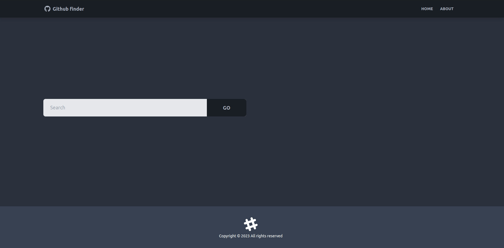

# GitHub Finder App

[GitHub Finder App](https://github-finder-app-zeta-fawn.vercel.app)



Dies ist eine GitHub Finder App, die mit Vite, React und Tailwind CSS erstellt wurde. Mit dieser App kannst du nach Benutzern auf GitHub suchen und deren Profile anzeigen.

## Funktionen

- Benutzersuche: Du kannst nach Benutzern auf GitHub suchen, indem du ihren Benutzernamen in das Suchfeld eingibst und auf die Suchschaltfläche klickst.

- Profilanzeige: Nachdem du nach einem Benutzer gesucht hast, kannst du auf seinen Namen klicken, um sein Profil anzuzeigen. Das Profil zeigt Informationen wie den Benutzernamen, die Anzahl der Follower, die Anzahl der Repositories und die Biografie des Benutzers.

## Verwendung

1. Öffne die [GitHub Finder App](https://github-finder-app-zeta-fawn.vercel.app) in deinem Browser.
2. Gib den Benutzernamen eines GitHub-Benutzers in das Suchfeld ein.
3. Klicke auf die Suchschaltfläche oder drücke die Eingabetaste.
4. Die App sucht nach dem Benutzer und zeigt eine Liste der Suchergebnisse an.
5. Klicke auf den Namen eines Benutzers, um sein Profil anzuzeigen.
6. Auf dem Profil werden Informationen über den Benutzer angezeigt, einschließlich des Benutzernamens, der Follower-Anzahl, der Anzahl der Repositories und der Biografie.

## Installation und lokale Entwicklung

Wenn du die App auf deinem eigenen Computer ausführen möchtest, kannst du die folgenden Schritte befolgen:

1. Stelle sicher, dass Node.js auf deinem Computer installiert ist.
2. Klone das GitHub-Repository:

   ```bash
   git clone git@github.com:Leotrimbehrami/github-finder-app.git

3. Navigiere in das Projektverzeichnis:

    ```bash
    cd github-finder-app
4. Installiere die  Abhängigkeiten:
    ```bash
    npm install
5. Starte den lokalen Entwicklungsserver:
    ```bash
    npm run dev
Die App sollte nun unter http://localhost:3000 verfügbar sein.

## Thechnologien

- Vite: Ein schnelles  Entwicklungs-Tool für moderne Webanwendungen.
- React: Eine JavaScript-Bibliothek für den Aufbau von Benutzeroberflächen.
- Tailwind CSS: Ein Utility-First CSS-Framework für die Gestaltung von Benutzeroberflächen.
- DaisyUI: Eine Erweiterung für Tailwind CSS, die vorgefertigte Komponenten und Klassen zur Verfügung stellt, um das Designprozess zu beschleunigen.

## Autor
- Leotrim Behrami  - [Github-Profil](https://github.com/Leotrimbehrami)

